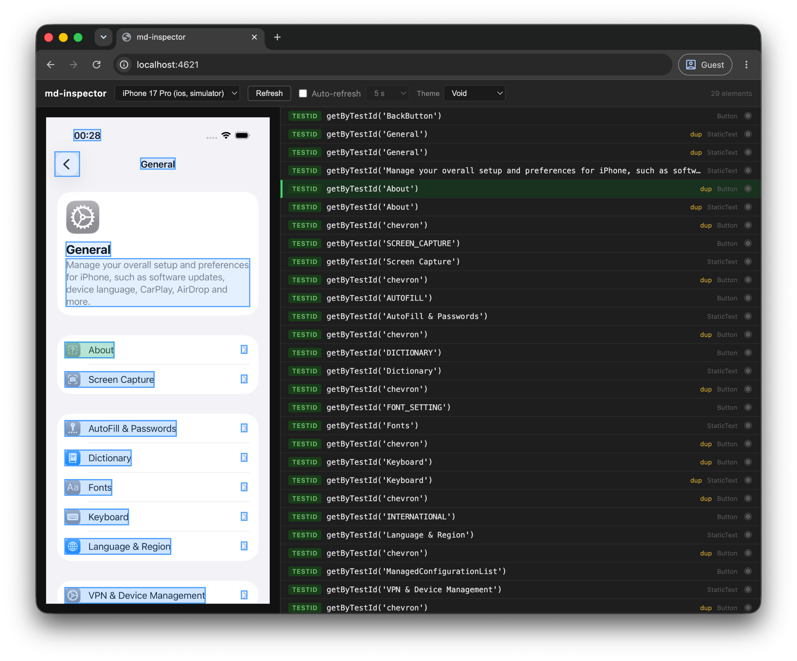

# Mobilewright Inspector

[](https://github.com/marcomaes/mobilewright-inspector/actions/workflows/ci.yml)

A local web app that shows you exactly what [mobilewright](https://github.com/mobile-next/mobilewright) sees on your connected device — and which locator it would use to target each element.

> **Not affiliated with MobileNext.** This is an independent fan project. I found myself constantly writing throwaway test scripts just to figure out the right locator for an element. A lot of people in the mobilewright community were asking for something like this, so I built it and decided to share it.

---

## What it does



Mobilewright Inspector splits your screen in two:

- **Left** — a live screenshot of your connected device or simulator
- **Right** — every element on screen, annotated with its best mobilewright locator

Click a locator in the list to highlight its bounding box on the screenshot. Click a highlighted box on the screenshot to select the matching row in the list.

Locators follow mobilewright's own priority order: `getByTestId` > `getByRole` > `getByLabel` > `getByText`. Elements that share a locator are flagged with a **dup** badge so you know when a locator is ambiguous.

---

## Features

- Live screenshot with click-to-highlight overlay
- Element list with best-match locator for every visible node
- Duplicate locator detection
- Show/hide individual elements on the overlay
- Device picker — auto-selects the first connected device, supports iOS and Android simultaneously
- Auto-refresh (5s / 10s / 20s / 30s / 1 min intervals)
- Five built-in themes
- Keyboard navigation on the element list
- No build step, no frontend framework — just Node.js

---

## Prerequisites

- **Node.js >= 18.2.0**
- A connected iOS device or booted simulator, **or** a connected Android device or running emulator
- mobilewright's own prerequisites for your platform — see the [mobilewright documentation](https://github.com/mobile-next/mobilewright) for setup instructions (Xcode / Android SDK / ADB)

---

## Installation

```bash
git clone https://github.com/marcomaes/mobilewright-inspector.git
cd mobilewright-inspector
npm install
```

---

## Usage

```bash
npm start
```

Then open [http://localhost:4621](http://localhost:4621) in your browser.

The first connected device or booted simulator is selected automatically. Use the device picker in the header to switch.

**Custom port:**

```bash
PORT=8080 npm start
```

**Development mode** (auto-restarts the server on file changes):

```bash
npm run dev
```

---

## How locators are derived

The locator shown for each element mirrors mobilewright's own matching logic, in priority order:

| Priority | Locator | Source field |
|----------|---------|-------------|
| 1 | `getByTestId` | `node.identifier` or `node.resourceId` |
| 2 | `getByRole` | `node.type` mapped to a role, name from `node.label ?? node.text` |
| 3 | `getByLabel` | `node.label` |
| 4 | `getByText` | `node.text ?? node.label ?? node.value` |

Elements with none of the above are shown with a **none** badge — they are not reliably locatable.

---

## Running tests

```bash
npm test
```

Tests cover locator derivation (exhaustive role mapping, priority order, special cases), device manager behaviour, and route integration. No device needed.

---

## Project structure

```
src/server/
  index.js                 # Express entry point
  lib/
    device-manager.js      # mobilewright device lifecycle
    locator-derivation.js  # ViewNode[] -> annotated element list
    logger.js              # structured stdout logger
  routes/
    devices.js             # GET /api/devices, POST /api/devices/:id/select
    inspect.js             # GET /api/inspect
public/
  index.html
  css/app.css
  js/app.js                # ScreenshotPane, ElementsPane, Inspector classes
tests/
  locator-derivation.test.js
  device-manager.test.js
  routes.test.js
```

---

## Contributing

Contributions are welcome. Please read [CONTRIBUTING.md](CONTRIBUTING.md) before opening a pull request.

---

## License

MIT — see [LICENSE](LICENSE).
